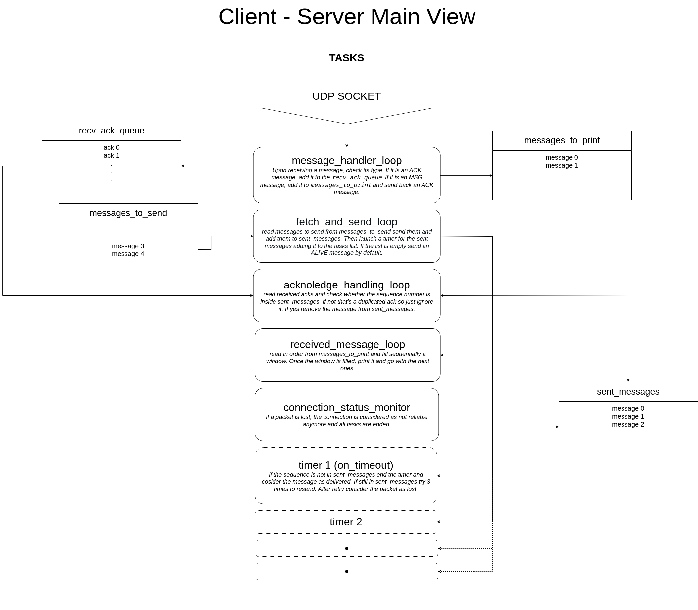

# Asynchronous Client-Server communication over UDP [deferred]

- C++/20
- CMake
- Docker
- Socket UDP

# Add Docker's official GPG key:
Install Docker https://docs.docker.com/engine/install/debian/

```
sudo apt-get update
sudo apt-get install ca-certificates curl
sudo install -m 0755 -d /etc/apt/keyrings
sudo curl -fsSL https://download.docker.com/linux/debian/gpg -o /etc/apt/keyrings/docker.asc
sudo chmod a+r /etc/apt/keyrings/docker.asc
```
# Add the repository to sources.list.d:

```
echo \
  "deb [arch=$(dpkg --print-architecture) signed-by=/etc/apt/keyrings/docker.asc] https://download.docker.com/linux/debian \
  $(. /etc/os-release && echo "$VERSION_CODENAME") stable" | \
  sudo tee /etc/apt/sources.list.d/docker.list > /dev/null
sudo apt-get update
```

please install the following packages:
```
sudo apt-get install docker-ce docker-ce-cli containerd.io docker-buildx-plugin docker-compose-plugin docker-compose
```
# Build and run within a Docker:
to compile and run client and server in a separate docker please use:
```
sudo docker-compose up --build
```
# Build and run with CMake :
to build and run the project please use: 
```
mkdir build; cd build; cmake ..; make ; ./< executable name >
```
# Arch main view


###### Improvements : 
- Manage message_processed and sequence rollover.
- Solve terminate called after throwing an instance of 'std::system_error'; what():  Resource temporarily unavailable
- Check whether the sendto function should be synchronized, create a synchronized wrapper.
- Investigate MEM% increasement in htop filtering by udp.